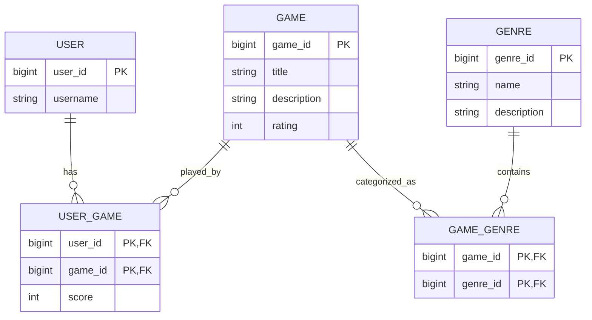

# Game Management Backend API - Documentation

## Table of Contents
- [Project Overview](#project-overview)
- [Technology Stack](#technology-stack)
- [System Architecture](#system-architecture)
- [Database Schema](#database-schema)
- [API Reference](#api-reference)
  - [Games API](#games-api)
  - [Users API](#users-api)
  - [Genres API](#genres-api)
  - [User-Game Relationships API](#user-game-relationships-api)
- [Setup & Configuration](#setup--configuration)
- [Usage Examples](#usage-examples)
- [Project Structure](#project-structure)
- [Development & Deployment](#development--deployment)

## Project Overview

The Game Management Backend API is a comprehensive RESTful service designed for managing games, users, genres, and user-game relationships with score tracking. Built with Spring Boot and MySQL, this API provides a complete backend solution for game cataloging and user interaction systems.

### Key Features
- **Game Management**: Create, read, update, and delete games with ratings and descriptions
- **User Management**: Register and manage users in the system
- **Genre Classification**: Categorize games into multiple genres for better organization
- **Score Tracking**: Record and manage user scores for games they've played
- **Relationship Management**: Handle many-to-many relationships between users, games, and genres

### Use Cases
- Game catalog management systems
- User score tracking applications
- Game recommendation engines
- Gaming community platforms

## Technology Stack

### Core Technologies
- **Java 17**: Modern Java runtime with enhanced performance and features
- **Spring Boot 4.0.1**: Framework for building production-ready applications
- **Spring Data JPA**: Object-relational mapping and data access layer
- **Spring Web (REST)**: RESTful web service implementation
- **MySQL 8.0**: Relational database management system

### Build & Development Tools
- **Maven 3.6+**: Build automation and dependency management
- **Git**: Version control system

## System Architecture

### Architecture Pattern
The application follows a layered architecture pattern with clear separation of concerns:

| Layer | Components | Purpose |
|-------|------------|---------|
| **REST API Layer** | Controllers: GameController, UserController, etc. | Handle HTTP requests and responses |
| **Service Layer** | Business Logic (Future) | Process business rules and orchestrate operations |
| **Data Access Layer** | Repositories: GameRepository, UserRepository, etc. | Database operations and data access |
| **Database Layer** | MySQL Database | Data persistence and storage |

### Design Patterns Used
- **Repository Pattern**: Data access abstraction through Spring Data JPA
- **Entity Pattern**: JPA entities representing database tables
- **REST Pattern**: RESTful API design with proper HTTP methods
- **Composite Key Pattern**: For junction tables with multiple primary keys

## Database Schema

### Entity Relationships



### Table Descriptions

#### 1. User Table
Stores user information in the system.

**Fields:**
- `user_id` (Primary Key): Auto-generated unique identifier
- `username` (String): Unique username for the user

#### 2. Game Table
Stores game catalog information.

**Fields:**
- `game_id` (Primary Key): Auto-generated unique identifier
- `title` (String): Game title/name
- `description` (String, Optional): Game description
- `rating` (Integer): Game rating (0-100)

#### 3. Genre Table
Stores game genre classifications.

**Fields:**
- `genre_id` (Primary Key): Auto-generated unique identifier
- `name` (String): Genre name
- `description` (String, Optional): Genre description

#### 4. User-Game Junction Table
Manages many-to-many relationships between users and games with score tracking.

**Fields:**
- `user_id` (Composite Primary Key, Foreign Key): References user
- `game_id` (Composite Primary Key, Foreign Key): References game
- `score` (Integer): User's score for the game

#### 5. Game-Genre Junction Table
Manages many-to-many relationships between games and genres.

**Fields:**
- `game_id` (Composite Primary Key, Foreign Key): References game
- `genre_id` (Composite Primary Key, Foreign Key): References genre

## API Reference

### Base URL
```
http://localhost:8080/api
```

### Response Format
All API responses follow a consistent JSON format:
```json
{
  "status": "success|error",
  "message": "Description of the result",
  "data": { "response data": "example" }
}
```

### Games API (`/api/game`)

#### Get All Games
**GET** `/api/game`

Returns a list of all games in the system.

**Response:**
```json
{
  "status": "success",
  "message": "Games retrieved successfully",
  "data": [
    {
      "gameId": 1,
      "title": "The Legend of Zelda",
      "description": "Action-adventure game",
      "rating": 95,
      "genres": [
        {
          "genreId": 1,
          "name": "Action",
          "description": "Fast-paced games with combat"
        }
      ]
    }
  ]
}
```

#### Get Game by ID
**GET** `/api/game/{id}`

Returns a specific game by its ID.

**Parameters:**
- `id` (Path): Game ID

**Response:**
```json
{
  "status": "success",
  "message": "Game retrieved successfully",
  "data": {
    "gameId": 1,
    "title": "The Legend of Zelda",
    "description": "Action-adventure game",
    "rating": 95,
    "genres": [...]
  }
}
```

#### Create New Game
**POST** `/api/game`

Creates a new game in the system.

**Request Body:**
```json
{
  "title": "New Game Title",
  "description": "Game description",
  "rating": 85
}
```

**Response:**
```json
{
  "status": "success",
  "message": "Game created successfully",
  "data": {
    "gameId": 2,
    "title": "New Game Title",
    "description": "Game description",
    "rating": 85,
    "genres": []
  }
}
```

#### Update Game (Full Update)
**PUT** `/api/game/{id}`

Completely replaces a game's information.

**Parameters:**
- `id` (Path): Game ID

**Request Body:**
```json
{
  "title": "Updated Game Title",
  "description": "Updated description",
  "rating": 90
}
```

**Response:**
```json
{
  "status": "success",
  "message": "Game updated successfully",
  "data": {
    "gameId": 1,
    "title": "Updated Game Title",
    "description": "Updated description",
    "rating": 90,
    "genres": [...]
  }
}
```

#### Update Game (Partial Update)
**PATCH** `/api/game/{id}`

Partially updates a game's information.

**Parameters:**
- `id` (Path): Game ID

**Request Body (Example - Update Rating Only):**
```json
{
  "rating": 92
}
```

**Response:**
```json
{
  "status": "success",
  "message": "Game updated successfully",
  "data": {
    "gameId": 1,
    "title": "The Legend of Zelda",
    "description": "Action-adventure game",
    "rating": 92,
    "genres": [...]
  }
}
```

#### Delete Game
**DELETE** `/api/game/{id}`

Deletes a game from the system.

**Parameters:**
- `id` (Path): Game ID

**Response:**
```json
{
  "status": "success",
  "message": "Game deleted successfully",
  "data": null
}
```

### Users API (`/api/user`)

#### Get All Users
**GET** `/api/user`

Returns a list of all users in the system.

**Response:**
```json
{
  "status": "success",
  "message": "Users retrieved successfully",
  "data": [
    {
      "userId": 1,
      "username": "gamer123"
    }
  ]
}
```

#### Get User by ID
**GET** `/api/user/{id}`

Returns a specific user by their ID.

**Parameters:**
- `id` (Path): User ID

**Response:**
```json
{
  "status": "success",
  "message": "User retrieved successfully",
  "data": {
    "userId": 1,
    "username": "gamer123"
  }
}
```

#### Create New User
**POST** `/api/user`

Creates a new user in the system.

**Request Body:**
```json
{
  "username": "newgamer"
}
```

**Response:**
```json
{
  "status": "success",
  "message": "User created successfully",
  "data": {
    "userId": 2,
    "username": "newgamer"
  }
}
```

#### Update User (Full Update)
**PUT** `/api/user/{id}`

Completely replaces a user's information.

**Parameters:**
- `id` (Path): User ID

**Request Body:**
```json
{
  "username": "updatedgamer"
}
```

**Response:**
```json
{
  "status": "success",
  "message": "User updated successfully",
  "data": {
    "userId": 1,
    "username": "updatedgamer"
  }
}
```

#### Update User (Partial Update)
**PATCH** `/api/user/{id}`

Partially updates a user's information.

**Parameters:**
- `id` (Path): User ID

**Request Body (Example):**
```json
{
  "username": "partiallyupdated"
}
```

**Response:**
```json
{
  "status": "success",
  "message": "User updated successfully",
  "data": {
    "userId": 1,
    "username": "partiallyupdated"
  }
}
```

#### Delete User
**DELETE** `/api/user/{id}`

Deletes a user from the system.

**Parameters:**
- `id` (Path): User ID

**Response:**
```json
{
  "status": "success",
  "message": "User deleted successfully",
  "data": null
}
```

### Genres API (`/api/genre`)

#### Get All Genres
**GET** `/api/genre`

Returns a list of all genres in the system.

**Response:**
```json
{
  "status": "success",
  "message": "Genres retrieved successfully",
  "data": [
    {
      "genreId": 1,
      "name": "Action",
      "description": "Fast-paced games with combat"
    }
  ]
}
```

#### Get Genre by ID
**GET** `/api/genre/{id}`

Returns a specific genre by its ID.

**Parameters:**
- `id` (Path): Genre ID

**Response:**
```json
{
  "status": "success",
  "message": "Genre retrieved successfully",
  "data": {
    "genreId": 1,
    "name": "Action",
    "description": "Fast-paced games with combat"
  }
}
```

#### Create New Genre
**POST** `/api/genre`

Creates a new genre in the system.

**Request Body:**
```json
{
  "name": "RPG",
  "description": "Role-playing games"
}
```

**Response:**
```json
{
  "status": "success",
  "message": "Genre created successfully",
  "data": {
    "genreId": 2,
    "name": "RPG",
    "description": "Role-playing games"
  }
}
```

#### Update Genre (Full Update)
**PUT** `/api/genre/{id}`

Completely replaces a genre's information.

**Parameters:**
- `id` (Path): Genre ID

**Request Body:**
```json
{
  "name": "Role-Playing",
  "description": "Updated RPG description"
}
```

**Response:**
```json
{
  "status": "success",
  "message": "Genre updated successfully",
  "data": {
    "genreId": 1,
    "name": "Role-Playing",
    "description": "Updated RPG description"
  }
}
```

#### Update Genre (Partial Update)
**PATCH** `/api/genre/{id}`

Partially updates a genre's information.

**Parameters:**
- `id` (Path): Genre ID

**Request Body (Example):**
```json
{
  "description": "Updated genre description"
}
```

**Response:**
```json
{
  "status": "success",
  "message": "Genre updated successfully",
  "data": {
    "genreId": 1,
    "name": "Action",
    "description": "Updated genre description"
  }
}
```

#### Delete Genre
**DELETE** `/api/genre/{id}`

Deletes a genre from the system.

**Parameters:**
- `id` (Path): Genre ID

**Response:**
```json
{
  "status": "success",
  "message": "Genre deleted successfully",
  "data": null
}
```

### User-Game Relationships API (`/api/user-game`)

#### Get All User-Game Relationships
**GET** `/api/user-game`

Returns all user-game relationships with their scores.

**Response:**
```json
{
  "status": "success",
  "message": "User-game relationships retrieved successfully",
  "data": [
    {
      "user": {
        "userId": 1,
        "username": "gamer123"
      },
      "game": {
        "gameId": 1,
        "title": "The Legend of Zelda",
        "description": "Action-adventure game",
        "rating": 95
      },
      "score": 85
    }
  ]
}
```

#### Get Specific User-Game Relationship
**GET** `/api/user-game/{userId}/{gameId}`

Returns a specific user-game relationship by user and game IDs.

**Parameters:**
- `userId` (Path): User ID
- `gameId` (Path): Game ID

**Response:**
```json
{
  "status": "success",
  "message": "User-game relationship retrieved successfully",
  "data": {
    "user": {
      "userId": 1,
      "username": "gamer123"
    },
    "game": {
      "gameId": 1,
      "title": "The Legend of Zelda",
      "description": "Action-adventure game",
      "rating": 95
    },
    "score": 85
  }
}
```

#### Create User-Game Relationship
**POST** `/api/user-game`

Creates a new user-game relationship with a score.

**Request Body:**
```json
{
  "userId": 1,
  "gameId": 1,
  "score": 90
}
```

**Response:**
```json
{
  "status": "success",
  "message": "User-game relationship created successfully",
  "data": {
    "user": {
      "userId": 1,
      "username": "gamer123"
    },
    "game": {
      "gameId": 1,
      "title": "The Legend of Zelda",
      "description": "Action-adventure game",
      "rating": 95
    },
    "score": 90
  }
}
```

#### Update User-Game Relationship (Full Update)
**PUT** `/api/user-game/{userId}/{gameId}`

Completely replaces a user-game relationship's score.

**Parameters:**
- `userId` (Path): User ID
- `gameId` (Path): Game ID

**Request Body:**
```json
{
  "score": 95
}
```

**Response:**
```json
{
  "status": "success",
  "message": "User-game relationship updated successfully",
  "data": {
    "user": {
      "userId": 1,
      "username": "gamer123"
    },
    "game": {
      "gameId": 1,
      "title": "The Legend of Zelda",
      "description": "Action-adventure game",
      "rating": 95
    },
    "score": 95
  }
}
```

#### Update User-Game Relationship (Partial Update)
**PATCH** `/api/user-game/{userId}/{gameId}`

Partially updates a user-game relationship's score.

**Parameters:**
- `userId` (Path): User ID
- `gameId` (Path): Game ID

**Request Body (Example):**
```json
{
  "score": 88
}
```

**Response:**
```json
{
  "status": "success",
  "message": "User-game relationship updated successfully",
  "data": {
    "user": {
      "userId": 1,
      "username": "gamer123"
    },
    "game": {
      "gameId": 1,
      "title": "The Legend of Zelda",
      "description": "Action-adventure game",
      "rating": 95
    },
    "score": 88
  }
}
```

#### Delete User-Game Relationship
**DELETE** `/api/user-game/{userId}/{gameId}`

Deletes a user-game relationship from the system.

**Parameters:**
- `userId` (Path): User ID
- `gameId` (Path): Game ID

**Response:**
```json
{
  "status": "success",
  "message": "User-game relationship deleted successfully",
  "data": null
}
```

## Setup & Configuration

### Prerequisites

Before you begin, ensure you have the following installed:

- **Java 17** or higher
- **Maven 3.6** or higher
- **MySQL 8.0** or compatible database server
- **Git** (for cloning the repository)

### Installation Steps

#### 1. Clone the Repository
```bash
git clone <repository-url>
cd 295_LB_Backend
```

#### 2. Database Setup

**Start MySQL Server:**
```bash
# On Windows
net start mysql

# On macOS/Linux
sudo systemctl start mysql
# or
brew services start mysql
```

**Create Database:**
The application will automatically create the `games` database and tables on startup due to the configuration `spring.jpa.hibernate.ddl-auto=update`.

**Database Configuration:**
Update `src/main/resources/application.properties` with your MySQL credentials:

```properties
spring.application.name=295_LB_Backend
spring.datasource.url=JDBC:mysql://127.0.0.1:3306/games?useSSL=false&allowPublicKeyRetrieval=true&serverTimezone=Europe/Zurich
spring.datasource.username=your_mysql_username
spring.datasource.password=your_mysql_password
spring.datasource.driver-class-name=com.mysql.cj.jdbc.Driver
spring.jpa.hibernate.ddl-auto=update
```

#### 3. Build and Run

**Build the project:**
```bash
mvn clean install
```

**Run the application:**
```bash
mvn spring-boot:run
```

The API will be available at `http://localhost:8080`

### Configuration Details

#### Application Properties

The application is configured through `src/main/resources/application.properties`:

```properties
# Application name
spring.application.name=295_LB_Backend

# Database connection
spring.datasource.url=JDBC:mysql://127.0.0.1:3306/games?useSSL=false&allowPublicKeyRetrieval=true&serverTimezone=Europe/Zurich
spring.datasource.username=root
spring.datasource.password=
spring.datasource.driver-class-name=com.mysql.cj.jdbc.Driver

# JPA configuration
spring.jpa.hibernate.ddl-auto=update
```

#### Configuration Options

- **spring.jpa.hibernate.ddl-auto**: Controls database schema generation
  - `update`: Updates schema without losing data (recommended for development)
  - `create`: Creates schema, destroying previous data
  - `create-drop`: Creates schema and drops on shutdown
  - `validate`: Validates schema without changes

## Usage Examples

### Complete Workflow Example

This example demonstrates a complete workflow showing how to use the API:

#### 1. Create a User
```bash
curl -X POST http://localhost:8080/api/user \
  -H "Content-Type: application/json" \
  -d '{
    "username": "alice"
  }'
```

**Response:**
```json
{
  "status": "success",
  "message": "User created successfully",
  "data": {
    "userId": 1,
    "username": "alice"
  }
}
```

#### 2. Create a Game
```bash
curl -X POST http://localhost:8080/api/game \
  -H "Content-Type: application/json" \
  -d '{
    "title": "Shadow Strike",
    "description": "A stealth-based action game",
    "rating": 85
  }'
```

**Response:**
```json
{
  "status": "success",
  "message": "Game created successfully",
  "data": {
    "gameId": 1,
    "title": "Shadow Strike",
    "description": "A stealth-based action game",
    "rating": 85,
    "genres": []
  }
}
```

#### 3. Create a Genre
```bash
curl -X POST http://localhost:8080/api/genre \
  -H "Content-Type: application/json" \
  -d '{
    "name": "Action",
    "description": "Fast-paced games with combat"
  }'
```

**Response:**
```json
{
  "status": "success",
  "message": "Genre created successfully",
  "data": {
    "genreId": 1,
    "name": "Action",
    "description": "Fast-paced games with combat"
  }
}
```

#### 4. Associate Game with Genre
To associate a game with a genre, you would typically update the game entity to include the genre. This would be done through the game update endpoint with the genre information included.

#### 5. Record User's Game Score
```bash
curl -X POST http://localhost:8080/api/user-game \
  -H "Content-Type: application/json" \
  -d '{
    "userId": 1,
    "gameId": 1,
    "score": 90
  }'
```

**Response:**
```json
{
  "status": "success",
  "message": "User-game relationship created successfully",
  "data": {
    "user": {
      "userId": 1,
      "username": "alice"
    },
    "game": {
      "gameId": 1,
      "title": "Shadow Strike",
      "description": "A stealth-based action game",
      "rating": 85
    },
    "score": 90
  }
}
```

#### 6. Get User's Games with Scores
```bash
curl http://localhost:8080/api/user-game
```

**Response:**
```json
{
  "status": "success",
  "message": "User-game relationships retrieved successfully",
  "data": [
    {
      "user": {
        "userId": 1,
        "username": "alice"
      },
      "game": {
        "gameId": 1,
        "title": "Shadow Strike",
        "description": "A stealth-based action game",
        "rating": 85
      },
      "score": 90
    }
  ]
}
```

### Common API Usage Patterns

#### Get All Games with Their Genres
```bash
curl http://localhost:8080/api/game
```

#### Get User's Game History
```bash
curl http://localhost:8080/api/user-game
```

#### Update a Game's Rating
```bash
curl -X PATCH http://localhost:8080/api/game/1 \
  -H "Content-Type: application/json" \
  -d '{
    "rating": 92
  }'
```

#### Delete a User-Game Relationship
```bash
curl -X DELETE http://localhost:8080/api/user-game/1/1
```

## Project Structure

### Package Organization

```
src/main/java/wiss/m295_lb/_95_lb_backend/
├── Application.java                    # Main application class
├── controller/                         # REST controllers
│   ├── GameController.java            # Game API endpoints
│   ├── UserController.java            # User API endpoints
│   ├── GenreController.java           # Genre API endpoints
│   └── connecting_table/              # Junction table controllers
│       └── UserGameController.java    # User-Game relationship endpoints
├── model/                             # JPA entities
│   ├── Game.java                      # Game entity
│   ├── User.java                      # User entity
│   ├── Genre.java                     # Genre entity
│   └── connecting_table/              # Junction table entities
│       ├── UserGame.java              # User-Game relationship entity
│       └── key/                       # Composite key classes
│           └── UserGameKey.java       # Composite key for UserGame
└── repository/                        # JPA repositories
    ├── GameRepository.java            # Game data access
    ├── UserRepository.java            # User data access
    ├── GenreRepository.java           # Genre data access
    └── connecting_table/              # Junction table repositories
        └── UserGameRepository.java    # User-Game relationship data access
```

### Key Components

#### Controllers
- **REST Endpoints**: Handle HTTP requests and responses
- **Input Validation**: Validate incoming data
- **Error Handling**: Manage exceptions and return appropriate HTTP status codes
- **Response Formatting**: Format responses consistently

#### Models (Entities)
- **JPA Annotations**: Define database mappings
- **Relationships**: Many-to-many and one-to-many relationships
- **Validation**: Data validation at the entity level
- **JSON Serialization**: Jackson annotations for API responses

#### Repositories
- **Data Access**: Interface for database operations
- **Custom Queries**: JPQL and native SQL queries
- **Pagination**: Support for large datasets
- **Sorting**: Order results by specific criteria

### Design Patterns

#### Repository Pattern
```java
@Repository
public interface GameRepository extends JpaRepository<Game, Long> {
    // Custom query methods placeholder
}
```

#### Entity Pattern
```java
@Entity
@Table(name = "game")
public class Game {
    @Id
    @GeneratedValue(strategy = GenerationType.IDENTITY)
    private Long gameId;
    // Entity fields and relationships
}
```

#### REST Controller Pattern
```java
@RestController
@RequestMapping("/api/game")
public class GameController {
    @Autowired
    private GameRepository gameRepository;
    
    @GetMapping
    public ResponseEntity<?> getAllGames() {
        // Controller implementation
    }
}
```

## Development & Deployment

### Build Instructions

#### Maven Commands
```bash
# Clean and build the project
mvn clean install

# Run tests (if any)
mvn test

# Package the application
mvn package

# Run the application
mvn spring-boot:run
```

#### Build Profiles
The application supports different build profiles for various environments:

```bash
# Development profile (default)
mvn spring-boot:run

# Production profile
mvn spring-boot:run -Dspring.profiles.active=prod
```

### Running the Application

#### Development Mode
```bash
mvn spring-boot:run
```

The application will start on `http://localhost:8080` with:
- Automatic restart on code changes
- Detailed logging
- H2 database (if configured)

#### Production Mode
```bash
# Build the JAR file
mvn clean package

# Run the JAR
java -jar target/295_LB_Backend-0.0.1-SNAPSHOT.jar
```

### Deployment Considerations

#### Environment Variables
For production deployment, consider using environment variables:

```bash
export SPRING_DATASOURCE_URL="jdbc:mysql://prod-server:3306/games"
export SPRING_DATASOURCE_USERNAME="prod_user"
export SPRING_DATASOURCE_PASSWORD="prod_password"
```

#### Docker Deployment
The application can be containerized using Docker:

```dockerfile
FROM openjdk:17-jre-slim
COPY target/295_LB_Backend-0.0.1-SNAPSHOT.jar app.jar
EXPOSE 8080
ENTRYPOINT ["java", "-jar", "/app.jar"]
```

#### Cloud Deployment
For cloud platforms like AWS, Azure, or Google Cloud:

1. **Database**: Use managed MySQL services
2. **Application**: Deploy as container or use platform-specific deployment
3. **Monitoring**: Implement health checks and logging
4. **Scaling**: Configure auto-scaling based on load

### Performance Considerations

#### Database Optimization
- Use appropriate indexes on frequently queried fields
- Implement pagination for large result sets
- Consider caching for frequently accessed data

#### API Optimization
- Use lazy loading for relationships to avoid N+1 queries
- Implement proper error handling and validation
- Use appropriate HTTP status codes

#### Security Considerations
- Validate all input data
- Use HTTPS in production
- Implement proper authentication and authorization (future enhancement)
- Sanitize database inputs to prevent SQL injection

### Monitoring & Logging

#### Application Logs
The application uses Spring Boot's logging framework. Configure logging levels in `application.properties`:

```properties
logging.level.wiss.m295_lb._95_lb_backend=DEBUG
logging.level.org.springframework.web=INFO
```

#### Health Checks
Spring Boot Actuator can be added for health monitoring:

```xml
<dependency>
    <groupId>org.springframework.boot</groupId>
    <artifactId>spring-boot-starter-actuator</artifactId>
</dependency>
```

This documentation provides a comprehensive guide for developers working with the Game Management Backend API. It covers setup, usage, architecture, and deployment considerations to ensure successful implementation and maintenance of the system.